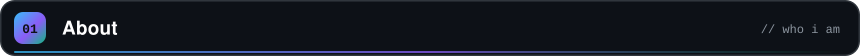
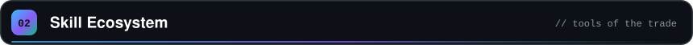
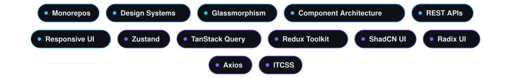

<!-- ═══════════════════════════ HERO ═══════════════════════════ -->

 

 

<!-- ═══════════════════════════ 01 ABOUT ═══════════════════════════ -->

 

### I build interfaces that feel instant and stay maintainable.

**React · Next.js · TypeScript** is home turf, from booking platforms and career marketplaces 
to fintech Telegram Mini Apps. I care about **scalable component architecture**, 
design systems that hold up under growth, and UI that looks as good as it performs.

Alongside shipping product, I'm going deep on fundamentals at **School 21 (42 Network)**: 
**C/C++ · algorithms · system programming**, learned peer-to-peer. That systems mindset 
is why I'm comfortable stepping past the browser into **NestJS, PostgreSQL and Python**.

⚡ Performance-minded &nbsp;·&nbsp; 🧩 Reusable by design &nbsp;·&nbsp; 🛡️ Type-safe by default &nbsp;·&nbsp; 🏗️ Architecture-first

 

<!-- ═══════════════════════════ 02 SKILLS ═══════════════════════════ -->

 

  

  

  

  

  

  

  

 

  

Built in Tashkent · shipped with React, TypeScript and too much coffee.

