 

  Crafting premium, high-performance web experiences with meticulous attention to detail. 
  Based in Tashkent, working globally.

  

    

<h3 align="center">C O R E &nbsp;&nbsp; S T A C K</h3>

 

    

